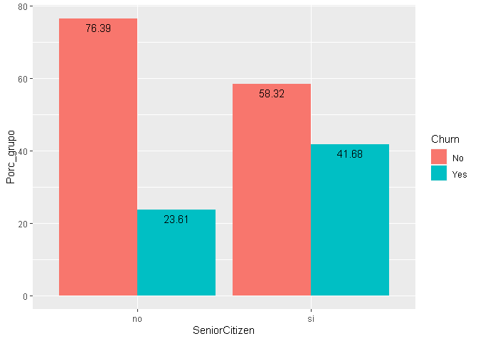
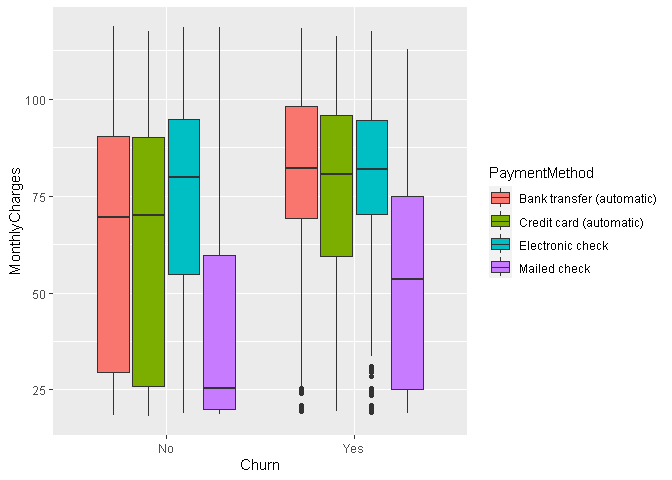

EDA
================

## Preliminares

``` r
library(tidyverse)
```

    ## Warning: package 'tidyverse' was built under R version 4.0.5

    ## -- Attaching packages --------------------------------------- tidyverse 1.3.1 --

    ## v ggplot2 3.4.4     v purrr   1.0.2
    ## v tibble  3.2.1     v dplyr   1.1.3
    ## v tidyr   1.3.0     v stringr 1.5.1
    ## v readr   2.1.4     v forcats 1.0.0

    ## -- Conflicts ------------------------------------------ tidyverse_conflicts() --
    ## x dplyr::filter() masks stats::filter()
    ## x dplyr::lag()    masks stats::lag()

``` r
library(magrittr)
```

    ## Warning: package 'magrittr' was built under R version 4.0.5

    ## 
    ## Attaching package: 'magrittr'

    ## The following object is masked from 'package:purrr':
    ## 
    ##     set_names

    ## The following object is masked from 'package:tidyr':
    ## 
    ##     extract

``` r
library(skimr)
library(janitor)
```

    ## 
    ## Attaching package: 'janitor'

    ## The following objects are masked from 'package:stats':
    ## 
    ##     chisq.test, fisher.test

### Importacion

``` r
data <- read_csv('Data/WA_Fn-UseC_-Telco-Customer-Churn.csv')
```

    ## Rows: 7043 Columns: 21
    ## -- Column specification --------------------------------------------------------
    ## Delimiter: ","
    ## chr (17): customerID, gender, Partner, Dependents, PhoneService, MultipleLin...
    ## dbl  (4): SeniorCitizen, tenure, MonthlyCharges, TotalCharges
    ## 
    ## i Use `spec()` to retrieve the full column specification for this data.
    ## i Specify the column types or set `show_col_types = FALSE` to quiet this message.

#### Verificar y corregir columnas

``` r
data %>% glimpse
```

    ## Rows: 7,043
    ## Columns: 21
    ## $ customerID       <chr> "7590-VHVEG", "5575-GNVDE", "3668-QPYBK", "7795-CFOCW~
    ## $ gender           <chr> "Female", "Male", "Male", "Male", "Female", "Female",~
    ## $ SeniorCitizen    <dbl> 0, 0, 0, 0, 0, 0, 0, 0, 0, 0, 0, 0, 0, 0, 0, 0, 0, 0,~
    ## $ Partner          <chr> "Yes", "No", "No", "No", "No", "No", "No", "No", "Yes~
    ## $ Dependents       <chr> "No", "No", "No", "No", "No", "No", "Yes", "No", "No"~
    ## $ tenure           <dbl> 1, 34, 2, 45, 2, 8, 22, 10, 28, 62, 13, 16, 58, 49, 2~
    ## $ PhoneService     <chr> "No", "Yes", "Yes", "No", "Yes", "Yes", "Yes", "No", ~
    ## $ MultipleLines    <chr> "No phone service", "No", "No", "No phone service", "~
    ## $ InternetService  <chr> "DSL", "DSL", "DSL", "DSL", "Fiber optic", "Fiber opt~
    ## $ OnlineSecurity   <chr> "No", "Yes", "Yes", "Yes", "No", "No", "No", "Yes", "~
    ## $ OnlineBackup     <chr> "Yes", "No", "Yes", "No", "No", "No", "Yes", "No", "N~
    ## $ DeviceProtection <chr> "No", "Yes", "No", "Yes", "No", "Yes", "No", "No", "Y~
    ## $ TechSupport      <chr> "No", "No", "No", "Yes", "No", "No", "No", "No", "Yes~
    ## $ StreamingTV      <chr> "No", "No", "No", "No", "No", "Yes", "Yes", "No", "Ye~
    ## $ StreamingMovies  <chr> "No", "No", "No", "No", "No", "Yes", "No", "No", "Yes~
    ## $ Contract         <chr> "Month-to-month", "One year", "Month-to-month", "One ~
    ## $ PaperlessBilling <chr> "Yes", "No", "Yes", "No", "Yes", "Yes", "Yes", "No", ~
    ## $ PaymentMethod    <chr> "Electronic check", "Mailed check", "Mailed check", "~
    ## $ MonthlyCharges   <dbl> 29.85, 56.95, 53.85, 42.30, 70.70, 99.65, 89.10, 29.7~
    ## $ TotalCharges     <dbl> 29.85, 1889.50, 108.15, 1840.75, 151.65, 820.50, 1949~
    ## $ Churn            <chr> "No", "No", "Yes", "No", "Yes", "Yes", "No", "No", "Y~

``` r
data %>% 
  mutate(
    SeniorCitizen= factor(SeniorCitizen, levels= c(0, 1), 
                             labels= c('no', 'si') )
  ) ->
  data
```

# EDA

## EDA Univariado

### Todas las variables

``` r
skim(data)
```

|                                                  |      |
|:-------------------------------------------------|:-----|
| Name                                             | data |
| Number of rows                                   | 7043 |
| Number of columns                                | 21   |
| \_\_\_\_\_\_\_\_\_\_\_\_\_\_\_\_\_\_\_\_\_\_\_   |      |
| Column type frequency:                           |      |
| character                                        | 17   |
| factor                                           | 1    |
| numeric                                          | 3    |
| \_\_\_\_\_\_\_\_\_\_\_\_\_\_\_\_\_\_\_\_\_\_\_\_ |      |
| Group variables                                  | None |

Data summary

**Variable type: character**

| skim_variable    | n_missing | complete_rate | min | max | empty | n_unique | whitespace |
|:-----------------|----------:|--------------:|----:|----:|------:|---------:|-----------:|
| customerID       |         0 |             1 |  10 |  10 |     0 |     7043 |          0 |
| gender           |         0 |             1 |   4 |   6 |     0 |        2 |          0 |
| Partner          |         0 |             1 |   2 |   3 |     0 |        2 |          0 |
| Dependents       |         0 |             1 |   2 |   3 |     0 |        2 |          0 |
| PhoneService     |         0 |             1 |   2 |   3 |     0 |        2 |          0 |
| MultipleLines    |         0 |             1 |   2 |  16 |     0 |        3 |          0 |
| InternetService  |         0 |             1 |   2 |  11 |     0 |        3 |          0 |
| OnlineSecurity   |         0 |             1 |   2 |  19 |     0 |        3 |          0 |
| OnlineBackup     |         0 |             1 |   2 |  19 |     0 |        3 |          0 |
| DeviceProtection |         0 |             1 |   2 |  19 |     0 |        3 |          0 |
| TechSupport      |         0 |             1 |   2 |  19 |     0 |        3 |          0 |
| StreamingTV      |         0 |             1 |   2 |  19 |     0 |        3 |          0 |
| StreamingMovies  |         0 |             1 |   2 |  19 |     0 |        3 |          0 |
| Contract         |         0 |             1 |   8 |  14 |     0 |        3 |          0 |
| PaperlessBilling |         0 |             1 |   2 |   3 |     0 |        2 |          0 |
| PaymentMethod    |         0 |             1 |  12 |  25 |     0 |        4 |          0 |
| Churn            |         0 |             1 |   2 |   3 |     0 |        2 |          0 |

**Variable type: factor**

| skim_variable | n_missing | complete_rate | ordered | n_unique | top_counts         |
|:--------------|----------:|--------------:|:--------|---------:|:-------------------|
| SeniorCitizen |         0 |             1 | FALSE   |        2 | no: 5901, si: 1142 |

**Variable type: numeric**

| skim_variable  | n_missing | complete_rate |    mean |      sd |    p0 |    p25 |     p50 |     p75 |    p100 | hist  |
|:---------------|----------:|--------------:|--------:|--------:|------:|-------:|--------:|--------:|--------:|:------|
| tenure         |         0 |             1 |   32.37 |   24.56 |  0.00 |   9.00 |   29.00 |   55.00 |   72.00 | ▇▃▃▃▆ |
| MonthlyCharges |         0 |             1 |   64.76 |   30.09 | 18.25 |  35.50 |   70.35 |   89.85 |  118.75 | ▇▅▆▇▅ |
| TotalCharges   |        11 |             1 | 2283.30 | 2266.77 | 18.80 | 401.45 | 1397.47 | 3794.74 | 8684.80 | ▇▂▂▂▁ |

### Posibles outliers

``` r
data %>% 
  reframe( 
    tibble(
      Descrip= c('P_0', 'P_02', 'P_25', 'P_50' , 'P_75', 'P_98', 'P_100') ,
      Valor= quantile( TotalCharges, c(0, 0.2, 0.25, 0.50 ,0.75, 0.98, 1), na.rm= T)
    )
    )
```

    ## # A tibble: 7 x 2
    ##   Descrip  Valor
    ##   <chr>    <dbl>
    ## 1 P_0       18.8
    ## 2 P_02     267. 
    ## 3 P_25     401. 
    ## 4 P_50    1397. 
    ## 5 P_75    3795. 
    ## 6 P_98    7721. 
    ## 7 P_100   8685.

### Balanceo de datos

``` r
data %>% 
  group_by(Churn) %>% 
  count()
```

    ## # A tibble: 2 x 2
    ## # Groups:   Churn [2]
    ##   Churn     n
    ##   <chr> <int>
    ## 1 No     5174
    ## 2 Yes    1869

# \## EDA Multivariado

## EDA Bivariado

### Room 2

#### Genero vs Churn

**Tabla**

**Grafico**

**Interpretacion**

#### PhoneService vs Churn

**Interpretacion**

### Room 4

#### SeniorCitizen vs Churn

**Tabla**

``` r
data %>%
  group_by(SeniorCitizen, Churn) %>%
  summarise(
    N = n(),
    Porc = round(100*N/nrow(data),2)
  ) %>%
  mutate(Porc_grupo = round(100*N/sum(N),2)) -> valores_Sc
```

    ## `summarise()` has grouped output by 'SeniorCitizen'. You can override using the
    ## `.groups` argument.

``` r
valores_Sc
```

    ## # A tibble: 4 x 5
    ## # Groups:   SeniorCitizen [2]
    ##   SeniorCitizen Churn     N  Porc Porc_grupo
    ##   <fct>         <chr> <int> <dbl>      <dbl>
    ## 1 no            No     4508 64.0        76.4
    ## 2 no            Yes    1393 19.8        23.6
    ## 3 si            No      666  9.46       58.3
    ## 4 si            Yes     476  6.76       41.7

``` r
# Comentado por conflictos con paquete
# tigerstats::rowPerc(xtabs(~SeniorCitizen+Churn, data=data) )
```

**Gráfico**

``` r
ggplot(valores_Sc, aes(x = SeniorCitizen, y = Porc_grupo, fill = Churn)) +
  geom_col(stat = "identity", position = "dodge") +
  geom_text(aes(label = Porc_grupo), vjust = 1.5,
            position = position_dodge(.9))
```

    ## Warning in geom_col(stat = "identity", position = "dodge"): Ignoring unknown
    ## parameters: `stat`

<!-- -->

**Interpretación**

De los adultos mayores el 41% abandonó el servicio, mientras que de los
no adultos mayores apenas un 24% abandonó el servicio. Aparentemente, un
adulto mayor tiene mayor probabilidad de abandonar el servicio.

#### MultipleLines vs Churn

**Tabla**

``` r
data %>%
  group_by(MultipleLines, Churn) %>%
  summarise(
    N = n(),
    Porc = round(100*N/nrow(data),2)
  ) %>%
  mutate(Porc_grupo = round(100*N/sum(N),2)) -> valores_Ml
```

    ## `summarise()` has grouped output by 'MultipleLines'. You can override using the
    ## `.groups` argument.

``` r
valores_Ml
```

    ## # A tibble: 6 x 5
    ## # Groups:   MultipleLines [3]
    ##   MultipleLines    Churn     N  Porc Porc_grupo
    ##   <chr>            <chr> <int> <dbl>      <dbl>
    ## 1 No               No     2541 36.1        75.0
    ## 2 No               Yes     849 12.0        25.0
    ## 3 No phone service No      512  7.27       75.1
    ## 4 No phone service Yes     170  2.41       24.9
    ## 5 Yes              No     2121 30.1        71.4
    ## 6 Yes              Yes     850 12.1        28.6

``` r
# Comentado por conflictos con paquete
# tigerstats::rowPerc(xtabs(~MultipleLines+Churn, data=data) )
```

**Gráfico**

``` r
ggplot(valores_Ml, aes(x = MultipleLines, y = N, fill = Churn)) +
  geom_col(stat = "identity", position = "dodge") +
  geom_text(aes(label = N), vjust = 1.5,
            position = position_dodge(.9))
```

    ## Warning in geom_col(stat = "identity", position = "dodge"): Ignoring unknown
    ## parameters: `stat`

<!-- -->

**Interpretación**

Entre las categorías de MultipleLines no hay mayor diferencia, entre los
que abandonan o no el servicio. Los porcentajes son muy parecidos.

#### TechSupport vs Churn

``` r
data %>%
  group_by(TechSupport, Churn) %>%
  summarise(
    N = n(),
    Porc = round(100*N/nrow(data),2)
  ) %>%
  mutate(Porc_grupo = round(100*N/sum(N),2)) -> valores_Ts
```

    ## `summarise()` has grouped output by 'TechSupport'. You can override using the
    ## `.groups` argument.

``` r
valores_Ts
```

    ## # A tibble: 6 x 5
    ## # Groups:   TechSupport [3]
    ##   TechSupport         Churn     N  Porc Porc_grupo
    ##   <chr>               <chr> <int> <dbl>      <dbl>
    ## 1 No                  No     2027  28.8       58.4
    ## 2 No                  Yes    1446  20.5       41.6
    ## 3 No internet service No     1413  20.1       92.6
    ## 4 No internet service Yes     113   1.6        7.4
    ## 5 Yes                 No     1734  24.6       84.8
    ## 6 Yes                 Yes     310   4.4       15.2

``` r
# Comentado por conflictos con paquete
# tigerstats::rowPerc(xtabs(~TechSupport+Churn, data=data) )
```

**Gráfico**

``` r
ggplot(valores_Ts, aes(x = TechSupport, y = N, fill = Churn)) +
  geom_col(stat = "identity", position = "dodge") +
  geom_text(aes(label = N), vjust = 1.5,
            position = position_dodge(.9))
```

    ## Warning in geom_col(stat = "identity", position = "dodge"): Ignoring unknown
    ## parameters: `stat`

<!-- -->

**Interpretación**

Los que no cuentan con soporte técnico, el 41.68% abandona el servicio.
Por otro lado, los que si cuentan con soporte apenas un 15.17% abandona
el servicio y los que no tienen internet contratado solo un 7.40%
abandona el servicio.

#### PaymentMethod vs Churn

``` r
data %>%
  group_by(PaymentMethod, Churn) %>%
  summarise(
    N = n(),
    Porc = round(100*N/nrow(data),2)
  ) %>%
  mutate(Porc_grupo = round(100*N/sum(N),2)) -> valores_Pm
```

    ## `summarise()` has grouped output by 'PaymentMethod'. You can override using the
    ## `.groups` argument.

``` r
valores_Pm
```

    ## # A tibble: 8 x 5
    ## # Groups:   PaymentMethod [4]
    ##   PaymentMethod             Churn     N  Porc Porc_grupo
    ##   <chr>                     <chr> <int> <dbl>      <dbl>
    ## 1 Bank transfer (automatic) No     1286 18.3        83.3
    ## 2 Bank transfer (automatic) Yes     258  3.66       16.7
    ## 3 Credit card (automatic)   No     1290 18.3        84.8
    ## 4 Credit card (automatic)   Yes     232  3.29       15.2
    ## 5 Electronic check          No     1294 18.4        54.7
    ## 6 Electronic check          Yes    1071 15.2        45.3
    ## 7 Mailed check              No     1304 18.5        80.9
    ## 8 Mailed check              Yes     308  4.37       19.1

``` r
# Comentado por conflictos con paquete
# tigerstats::rowPerc(xtabs(~PaymentMethod+Churn, data=data) )
```

**Gráfico**

``` r
ggplot(valores_Pm, aes(x = PaymentMethod, y = N, fill = Churn)) +
  geom_col(stat = "identity", position = "dodge") +
  geom_text(aes(label = N), vjust = 1.5,
            position = position_dodge(.9))
```

    ## Warning in geom_col(stat = "identity", position = "dodge"): Ignoring unknown
    ## parameters: `stat`

<!-- -->

**Interpretación**

A excepción de los que pagan con cheque electrónico los porcentajes de
abandono son muy parecidos. En el caso de los que pagan con cheque
electrónico un 45.29% abandona el servicio.

### Room 6

### Room 8

#### Eda Bivariado entre churn y Dependents

``` r
data %>% tabyl(Churn, Dependents ) -> t1

t1 %>% adorn_totals(c("row", "col")) %>% adorn_percentages("all") %>%
adorn_pct_formatting(rounding = "half up", digits = 0) %>% adorn_ns() %>%
  adorn_title("combined") %>% knitr::kable()
```

| Churn/Dependents | No          | Yes         | Total        |
|:-----------------|:------------|:------------|:-------------|
| No               | 48% (3,390) | 25% (1,784) | 73% (5,174)  |
| Yes              | 22% (1,543) | 5% (326)    | 27% (1,869)  |
| Total            | 70% (4,933) | 30% (2,110) | 100% (7,043) |

``` r
data %>% count(Churn, Dependents) %>%
  mutate(porc = n / sum(n)) %>% 
  ggplot(aes(fill=Dependents, y=porc, x=Churn)) + 
    geom_col(position="stack") +
    geom_text(aes(label=scales::percent(porc)),position = position_stack(vjust=0.5))+
  scale_y_continuous(labels = scales::percent_format()) 
```

<!-- -->

De la muestra analizada alrededor del 27% corresponde a individuos que
dejaron sus planes en el último mes. Además se conoce que el 4,6% de
estos individuos contaban con personas dependientes.

#### Eda Bivariado entre churn y OnlineSecurity

``` r
data %>% tabyl(Churn,OnlineSecurity ) -> t2

t2 %>% adorn_totals(c("row", "col")) %>% adorn_percentages("all") %>%
adorn_pct_formatting(rounding = "half up", digits = 0) %>% adorn_ns()%>% adorn_title("combined")%>% knitr::kable()
```

| Churn/OnlineSecurity | No          | No internet service | Yes         | Total        |
|:---------------------|:------------|:--------------------|:------------|:-------------|
| No                   | 29% (2,037) | 20% (1,413)         | 24% (1,724) | 73% (5,174)  |
| Yes                  | 21% (1,461) | 2% (113)            | 4% (295)    | 27% (1,869)  |
| Total                | 50% (3,498) | 22% (1,526)         | 29% (2,019) | 100% (7,043) |

``` r
data %>% count(Churn, OnlineSecurity) %>%
  mutate(porc = n / sum(n)) %>% 
  ggplot(aes(fill=OnlineSecurity, y=porc, x=Churn)) + 
    geom_col(position="stack") +
    geom_text(aes(label=scales::percent(porc)),position = position_stack(vjust=0.5))+
  scale_y_continuous(labels = scales::percent_format()) 
```

<!-- -->

El 20,74% de los indviduos analizados y que abandonaron el servicio no
contaban con seguridad en línea. Por otro lado aquellos que no salieron
del plan reflejaron una participación similar con relación al servicio
de seguridad en línea.

#### Eda Bivariado entre Churn y StreamingMovies

``` r
data %>% tabyl(Churn,StreamingMovies) -> t3

t3 %>% adorn_totals(c("row", "col")) %>% adorn_percentages("all") %>%
adorn_pct_formatting(rounding = "half up", digits = 0) %>% adorn_ns()%>% adorn_title("combined")%>% knitr::kable()
```

| Churn/StreamingMovies | No          | No internet service | Yes         | Total        |
|:----------------------|:------------|:--------------------|:------------|:-------------|
| No                    | 26% (1,847) | 20% (1,413)         | 27% (1,914) | 73% (5,174)  |
| Yes                   | 13% (938)   | 2% (113)            | 12% (818)   | 27% (1,869)  |
| Total                 | 40% (2,785) | 22% (1,526)         | 39% (2,732) | 100% (7,043) |

``` r
data %>% count(Churn, StreamingMovies) %>%
  mutate(porc = n / sum(n)) %>% 
  ggplot(aes(fill=StreamingMovies, y=porc, x=Churn)) + 
    geom_col(position="stack") +
    geom_text(aes(label=scales::percent(porc)),position = position_stack(vjust=0.5))+
  scale_y_continuous(labels = scales::percent_format()) 
```

<!-- -->

El 13,32% de los indviduos analizados y que abandonaron el servicio no
contaban con servicio de Streaming Movies. Sin embargo, tanto para el
grupo que abandonaron o mantuvieron el servicio no se evidencia una
importancia relevante para su salidad del plan.

#### Eda Bivariado entre churn y Total Charges

``` r
data %>%  group_by(Churn) %>% 
  summarise(n = n(),
            promedio = mean(TotalCharges,na.rm = T),
            n_missing = sum(is.na(TotalCharges)),
            desv = sd(TotalCharges, na.rm =T)) -> t4
t4
```

    ## # A tibble: 2 x 5
    ##   Churn     n promedio n_missing  desv
    ##   <chr> <int>    <dbl>     <int> <dbl>
    ## 1 No     5174    2555.        11 2329.
    ## 2 Yes    1869    1532.         0 1891.

``` r
data %>%
  ggplot(aes(x = Churn, y = TotalCharges, fill = Churn)) +
  geom_boxplot() +
  stat_summary(fun = mean, geom = "point", shape = 3, size = 3,
               color = "white", position = position_dodge(width = 0.75)) +
  labs(title = "Churn vs Total Charges",
       x = "Churn",
       y = "Total Charges") +
        theme_minimal()
```

    ## Warning: Removed 11 rows containing non-finite values (`stat_boxplot()`).

    ## Warning: Removed 11 rows containing non-finite values (`stat_summary()`).

<!-- -->

En promedio el gasto total en el servicio de telecomunicaciones para los
individuos que salieron del plan es inferior por usuario en alrededor de
USD 1000. Para los usuarios que salieron del servicio se evidencia datos
atípicos elevados que alcanzan los valores máximos de los usarios que no
salieron del servicio. Cabe señalar que, para los usuarios que no
abandoron el servicio su extipendio total del plan se concentra entre el
rango intercuartílico. Adicionalmente, se observa que la variable gasto
total cuenta con 11 valores perdidos.

#### Eda Multivariado entre MonthlyCharges vs Dependents vs Churn

``` r
data %>%  group_by(Churn,Dependents) %>% 
    summarise(n = n(),
            promedio = mean(MonthlyCharges,na.rm = T),
            n_missing = sum(is.na(MonthlyCharges)),
            desv = sd(MonthlyCharges, na.rm =T)) -> t5
```

    ## `summarise()` has grouped output by 'Churn'. You can override using the
    ## `.groups` argument.

``` r
t5
```

    ## # A tibble: 4 x 6
    ## # Groups:   Churn [2]
    ##   Churn Dependents     n promedio n_missing  desv
    ##   <chr> <chr>      <int>    <dbl>     <int> <dbl>
    ## 1 No    No          3390     63.5         0  30.6
    ## 2 No    Yes         1784     57.1         0  31.6
    ## 3 Yes   No          1543     74.8         0  24.4
    ## 4 Yes   Yes          326     72.9         0  25.8

``` r
data %>%
  ggplot(aes(x = Churn, y = MonthlyCharges, fill = Dependents)) +
  geom_boxplot() +
  stat_summary(fun = mean, geom = "point", shape = 3, size = 3, color = "white", position = position_dodge(width = 0.75)) +
  labs(title = "Monthtly Charges for Dependents vs Churn",
       x = "Churn",
       y = "Monthly Charges")
```

<!-- -->

La distribución del gasto mensual de aquellos individuos que no salieron
del plan se concentra dentro del cuartil 1 y cuartil 3, además entre el
máximo y mínimo de los que dejaron el servicio respecto de los que se
quedaron no se verifica mayor diferencia. Es importante destacar que,
tanto el promedio como la mediana del pago mensual es superior en los
individuos que salieron del plan de los que se quedaron, no obstante no
se verifica mayor diferencia respecto de contar o no con dependientes en
los usuarios que abandonaron el plan.

### Room 9

### Room 10

## EDA Multivariado

### Room 4

#### MonthlyCharges vs PaymentMethod vs Churn

**Gráfico 1**

``` r
ggplot(data, aes(x = PaymentMethod, y = MonthlyCharges, fill = Churn)) +
  geom_boxplot()
```

<!-- -->
**Interpretación**

**Gráfico 2**

``` r
ggplot(data, aes(x = Churn, y = MonthlyCharges, fill = PaymentMethod)) +
  geom_boxplot()
```

<!-- -->

**Interpretación**

Los montos de pago de aquellos que abandonan el servicio son superiores
a aquellos que permanecen con excepción de los que pagan por cheque
electrónico.
